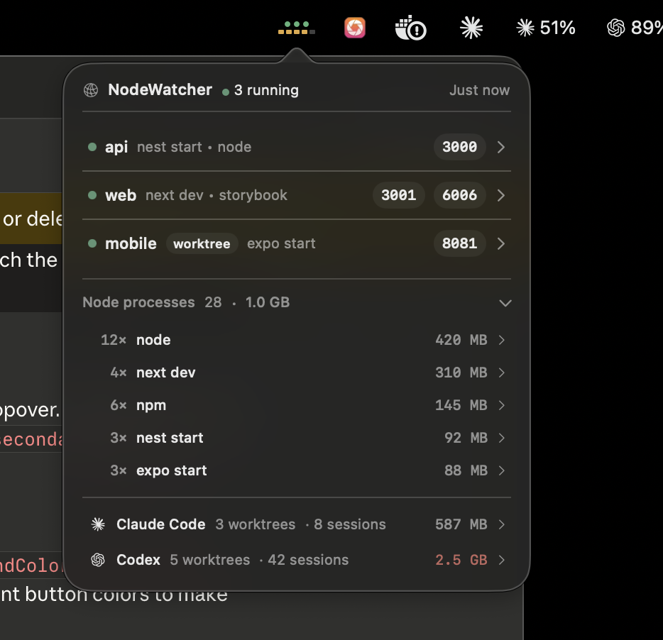

<p align="center">
  <h1 align="center">NodeWatcher</h1>
  <p align="center">
    A macOS menu bar app that shows which local ports are in use, who owns them, and whether it's your dev server or something blocking it.
  </p>
  <p align="center">
    <a href="https://github.com/jskoiz/node-watcher/actions/workflows/ci.yml"></a>
    <a href="https://github.com/jskoiz/node-watcher/releases/latest"></a>
    <a href="LICENSE"></a>
    <a href="https://www.apple.com/macos/"></a>
    <a href="https://swift.org"></a>
  </p>
</p>

---

If you've ever had multiple projects fighting over ports 3000, 5173, or 8081 and resorted to a pile of `lsof` and `ps` commands — NodeWatcher replaces all of that with a single glance at your menu bar.

<p align="center">
  
</p>

## Features

- **Live port monitoring** in the menu bar with a compact summary
- **Project-aware** — maps Node processes back to their project root (`package.json`, `.git`, lockfiles)
- **Smart classification** — identifies Vite, Next.js, Expo, Storybook, Nest, and other Node-family tools by name
- **Conflict detection** — distinguishes "your app owns this port" from "Docker is blocking it" or "an SSH tunnel is occupying it"
- **Safe actions** — context-aware resolution (free port, stop tunnel, configurable port command template) with no destructive force-kill
- **Configurable** — settings for watched ports, refresh cadence, display modes, hotkeys, port command template, and grouping
- **CLI included** — `nodetracker snapshot --json` for scripting and CI

## Install

### Download (recommended)

Grab the latest signed and notarized `.app` from [**Releases**](https://github.com/jskoiz/node-watcher/releases/latest), unzip, and drag to Applications.

Requires macOS 14 (Sonoma) or later.

### Homebrew

```bash
brew tap jskoiz/nodewatcher
brew install --cask nodewatcher
```

### Build from source

Requires Swift 6.0+ (Xcode 16+):

```bash
git clone https://github.com/jskoiz/node-watcher.git
cd node-watcher
./Scripts/package_app.sh
open .build/NodeWatcher.app
```

## How It Works

NodeWatcher builds a snapshot of local listening processes in a pipeline:

1. **Probe** — scans TCP sockets via `lsof`
2. **Enrich** — adds process metadata from `ps`
3. **Resolve** — walks up from the process working directory to find the project root
4. **Classify** — identifies Node-family dev tools (vite, next, expo, etc.) from the command line
5. **Collapse** — deduplicates IPv4/IPv6 listeners into one logical port owner
6. **Assess** — marks watched ports as owned by your app or blocked by something else

This is why NodeWatcher says "3000 is blocked by Docker" or "8081 is owned by the Expo app in `~/projects/mobile`" instead of just "PID 12345 is using port 3000."

## CLI

```bash
# Live snapshot of all listening processes
nodetracker snapshot --json

# Pretty-print with port filtering
nodetracker snapshot --json | jq '.projects'

# Dump test fixtures
nodetracker fixtures --name mixed --json
```

## Architecture

```
Sources/
  NodeTrackerCore/    # Models, parsers, classifier, snapshot service (no UI)
  NodeTrackerApp/     # SwiftUI menu bar app
  NodeTrackerCLI/     # CLI commands (snapshot, fixtures)
Tests/
  NodeTrackerCoreTests/   # Fixture-based parser, resolver, and integration tests
Scripts/
  package_app.sh      # Build and wrap into .app bundle
  dev_harness.sh      # Spin up local test listeners for manual testing
```

The core library (`NodeTrackerCore`) is deliberately free of AppKit/SwiftUI so it can be tested independently and reused by both the GUI and CLI.

## Roadmap

NodeWatcher is intentionally narrow — it solves port conflicts for local dev, and it does that well. Future work stays focused on that mission.

### Planned

- [ ] **Notifications** — alert when a watched port becomes blocked or freed
- [ ] **Port history** — show which project last used a port and when
- [ ] **Launch at login** — optional auto-start on macOS boot
- [ ] **Quick-switch ports** — one-click to restart a dev server on a suggested alternate port
- [ ] **Monorepo awareness** — better grouping for Turborepo/Nx/pnpm workspace projects
- [ ] **Process tree view** — visualize parent-child relationships (e.g., which `node` spawned which)

### Considering

- [ ] **Menubar widgets** — compact inline port status without opening the popover
- [ ] **Profiles** — save port configurations per project or workspace
- [ ] **Export/share** — copy a snapshot as Markdown or JSON for bug reports
- [ ] **Plugin system** — user-defined classifiers for non-Node dev servers (Python, Go, Ruby)

### Not planned

- General process manager features (use Activity Monitor)
- Remote server monitoring (this is a local-only tool)
- Windows/Linux support (macOS-native by design)

Have an idea? [Open a feature request](https://github.com/jskoiz/node-watcher/issues/new?template=feature_request.md).

## Development

```bash
# Build
swift build

# Test
swift test

# Run with sample data
swift run NodeTrackerApp --sample-data

# Run the dev harness (creates real test listeners)
./Scripts/dev_harness.sh
```

See [`docs/dev-harness.md`](docs/dev-harness.md) for the full testing strategy and [`docs/architecture.md`](docs/architecture.md) for module boundaries.

## Contributing

Contributions are welcome! Please read [CONTRIBUTING.md](CONTRIBUTING.md) before opening a pull request.

## License

[MIT](LICENSE)
